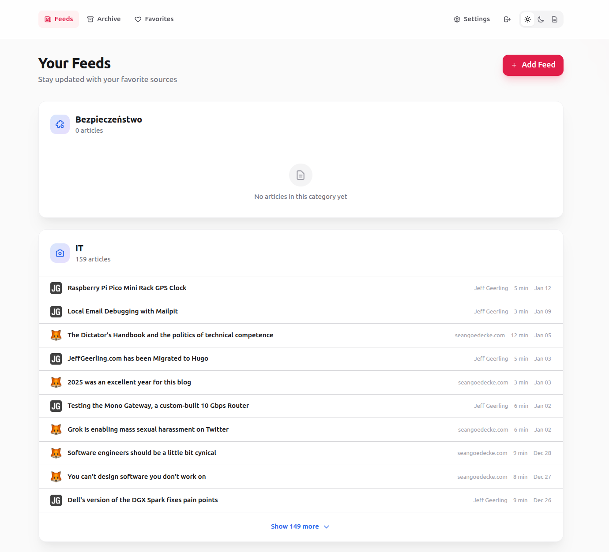
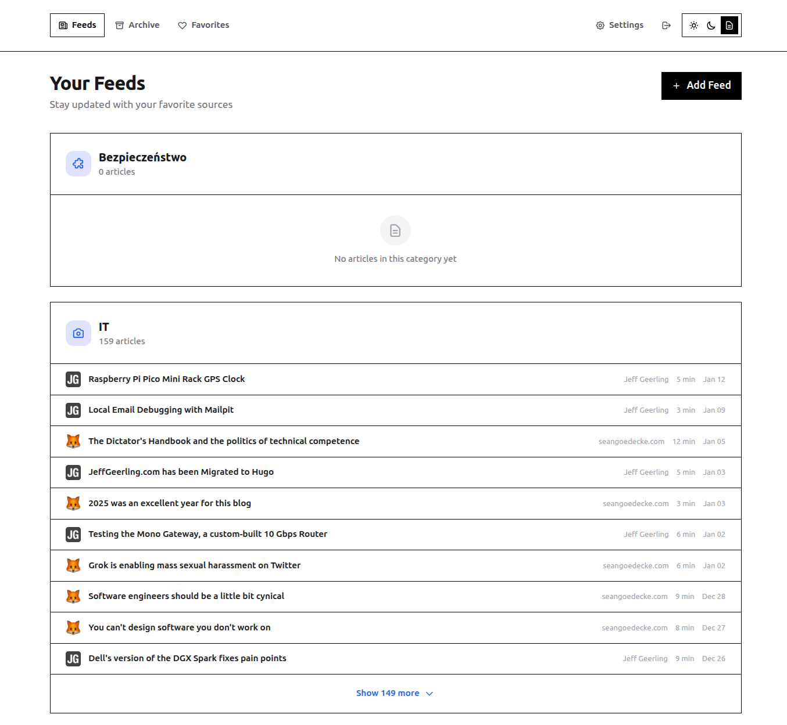
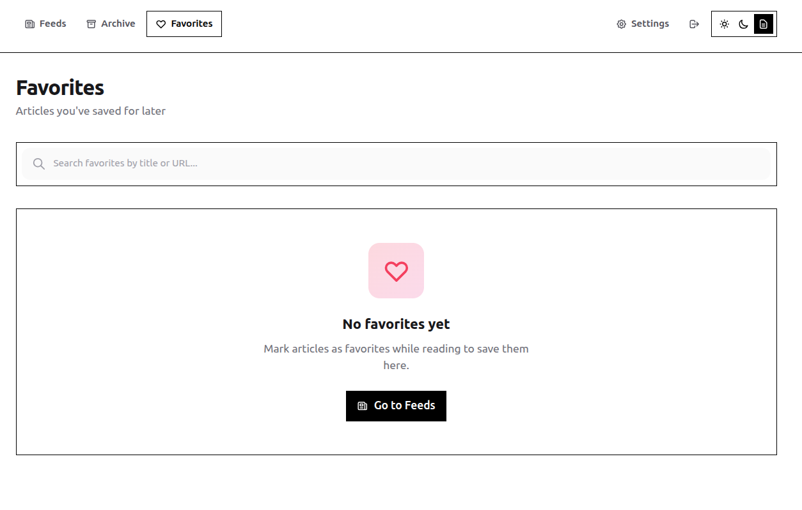
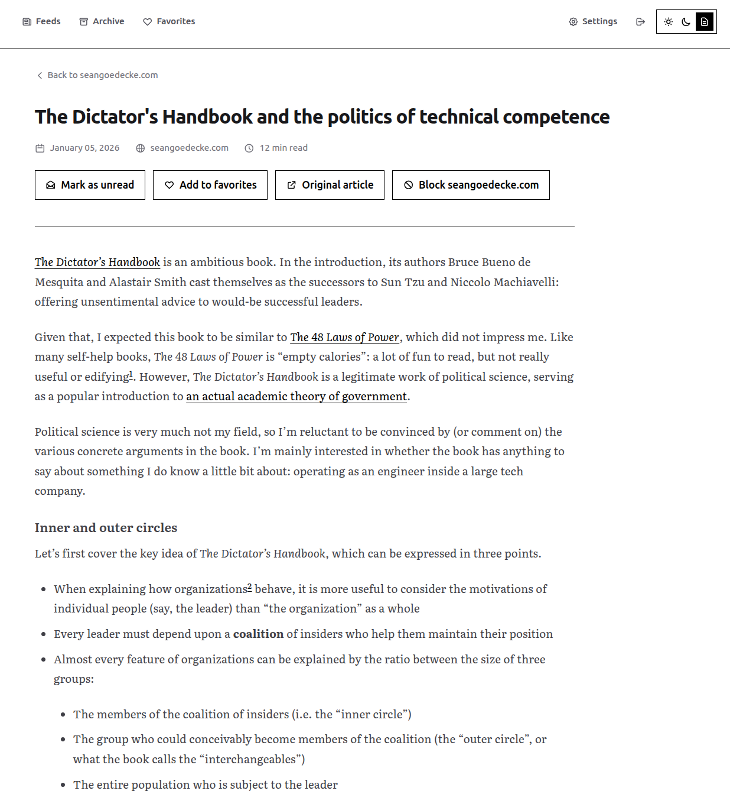

# Feedy

A self-hosted RSS reader that strips away the clutter. Feedy fetches articles and extracts clean, readable content.

<p>
  <a href="docs/screens/light/feed.png"></a>
</p>

<p>
  <a href="docs/screens/eink/feed.png"></a>
  <a href="docs/screens/eink/favorites.png"></a>
</p>

<p>
<a href="docs/screens/eink/article.png"></a>
</p>


## Highlights

- **Distraction-free reading** — Extracts article content, removes the noise
- **Private** — Self-hosted, no tracking, your data stays yours
- **E-ink friendly** — Monochrome theme designed for e-readers (plus Light and Dark)
- **OPML support** — Easy import/export from other readers
- **Bookmarklet** — Subscribe to any site with one click

## Quick Start

```bash
git clone <repository-url>
cd <folder-name>
docker compose up -d
```

## Docker Compose

```yml
services:
  app:
    image: ghcr.io/lukas346/feedy:latest
    ports:
      - "${APP_PORT:-5532}:8000"
    volumes:
      - sqlite_data:/app/data
      - logs_data:/app/logs
    environment:
      - DATABASE_URL=${DATABASE_URL:-sqlite:////app/data/reader.db}
      - WORKER_INTERVAL_MINUTES=${WORKER_INTERVAL_MINUTES:-15}
      - BASE_URL=${BASE_URL:-https://feedy.example.com}
    restart: unless-stopped
    healthcheck:
      test: ["CMD", "curl", "-f", "http://localhost:8000/health"]
      interval: 30s
      timeout: 10s
      retries: 3


  worker:
    image: ghcr.io/lukas346/feedy:latest
    entrypoint: ["python", "-m", "worker"]
    command: []
    volumes:
      - sqlite_data:/app/data
      - logs_data:/app/logs
    environment:
      - DATABASE_URL=${DATABASE_URL:-sqlite:////app/data/reader.db}
      - WORKER_INTERVAL_MINUTES=${WORKER_INTERVAL_MINUTES:-15}
    restart: unless-stopped
    depends_on:
      app:
        condition: service_healthy


volumes:
  sqlite_data:
  logs_data:
```

Open [http://localhost:5532](http://localhost:5532) and add your feeds. Default password `admin`.

**Project is mirrored from private gitlab repo.**

## License

MIT
